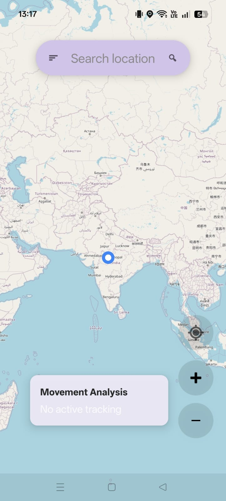
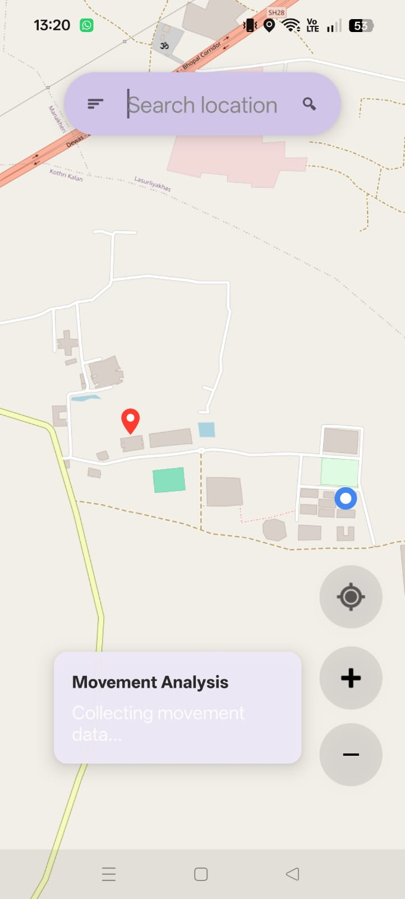
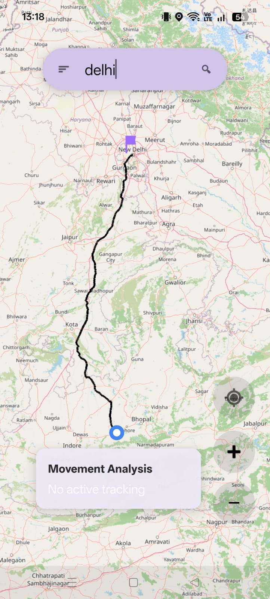
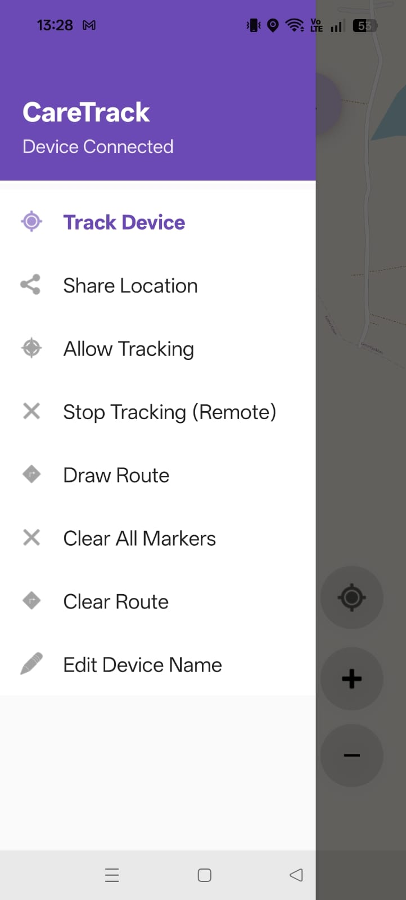

# CareTrack

A real-time Android GPS tracking application built using Java, Firebase Realtime Database, OpenStreetMap (OSMdroid), and the MVVM architecture. CareTrack allows users to share their live location, track other connected devices, search locations, and visualize routes on an interactive map.

---

## Features

- 📍 Real-time GPS location tracking
- 🔄 Live location sharing using Firebase Realtime Database
- 👥 Track connected devices in real time
- 🗺️ OpenStreetMap integration (OSMdroid)
- 🔎 Location search using Nominatim API
- 🚗 Route generation using OSRM API
- 📈 Basic movement analytics
- 📡 Foreground service for background location updates
- 📝 Device renaming
- 📤 Share current location via Google Maps link

---

## Tech Stack

- Java
- Android SDK
- MVVM Architecture
- Firebase Realtime Database
- OSMdroid
- OpenStreetMap
- Nominatim Search API
- OSRM Routing API
- OkHttp

---

## Project Structure

```
app/
├── analytics/
├── map/
├── model/
├── network/
├── tracking/
├── ui/
├── FirebaseHelper.java
├── LocationHelper.java
├── MainActivity.java
├── MapViewModel.java
└── AppRepository.java
```

---

## Screenshots







---

## Firebase Setup

This repository does **not** include Firebase configuration files.

To run the project:

1. Create a Firebase project.
2. Enable Firebase Realtime Database.
3. Add your own `google-services.json` inside the `app/` directory.
4. Replace the placeholder database URL in `FirebaseHelper.java`.

```java
FirebaseDatabase.getInstance("YOUR-FIREBASE-APP-URL")
```

---

## Permissions

The application requires:

- Internet
- Fine Location
- Coarse Location
- Foreground Location Service
- Notifications (Android 13+)

---

## Architecture

```
LocationHelper
      │
      ▼
MapViewModel
      │
      ▼
AppRepository
      │
      ▼
Firebase Realtime Database
```

---

## Future Improvements

- Authentication
- Secure tracking permissions
- Geofencing
- Push notifications
- Distance and speed statistics
- ETA calculation
- Better movement analytics

---

## License

This project is licensed under the MIT License.

---

## Author
Devya Saigal
**Devya Saigal**

GitHub: https://github.com/Devya29
